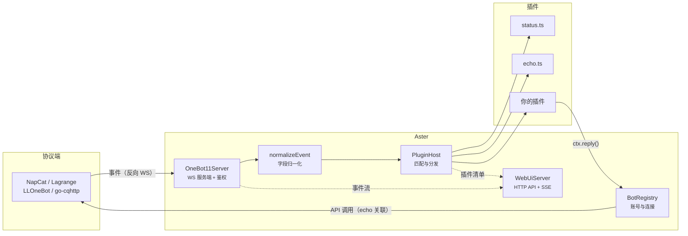
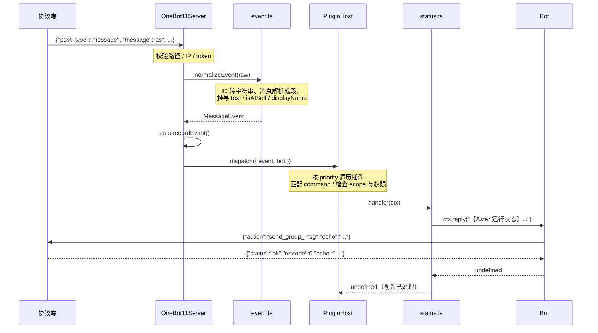
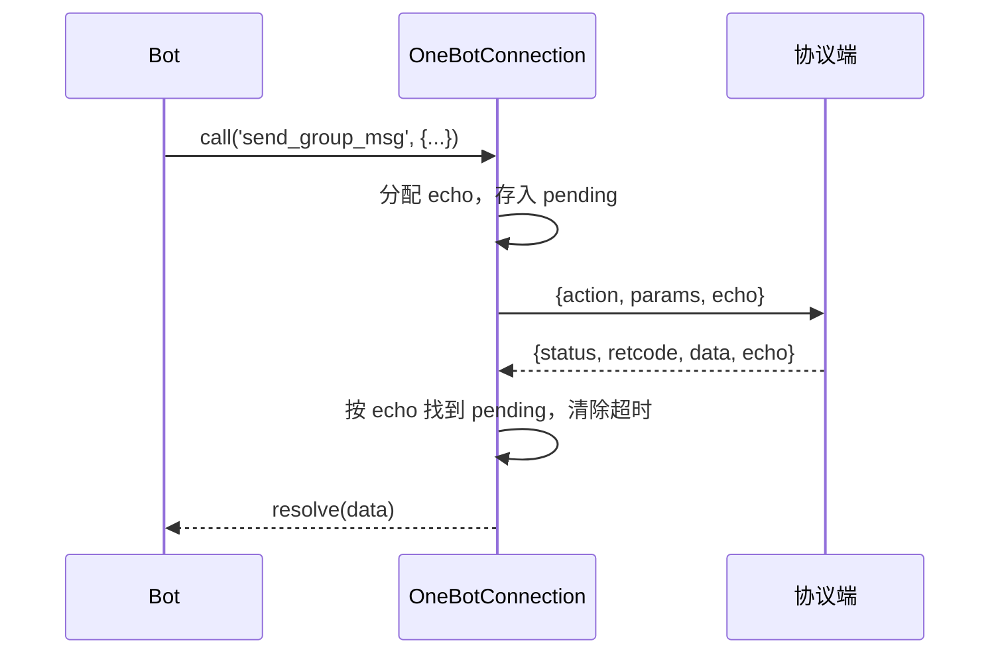
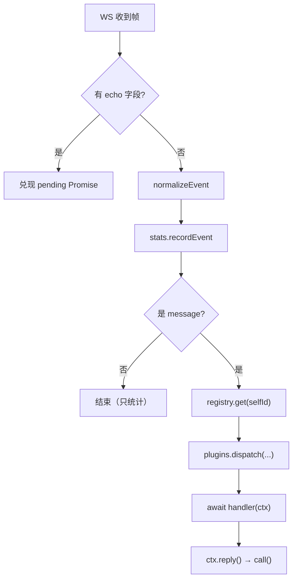
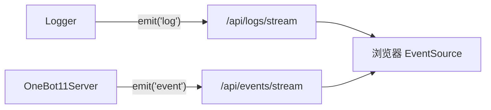

# 架构说明

## 全貌



一句话概括：**协议端主动连上来推事件，框架归一化后交给插件，插件通过账号句柄把消息发回去。**

## 一次消息的完整路径

以群里有人发 `as` 为例：



## 模块职责

| 文件 | 职责 | 关键点 |
|------|------|--------|
| `message.ts` | 消息段与 CQ 码 | 三种输入形态归一；转义与反转义 |
| `event.ts` | 事件归一化 | 容忍字段类型差异；未知事件不丢弃 |
| `onebot11.ts` | 适配器 | WS 服务端、echo 关联、账号注册表 |
| `plugin.ts` | 插件 API | `definePlugin` 在**加载期**校验 |
| `plugin-host.ts` | 插件宿主 | 加载、匹配、分发、热重载 |
| `config.ts` | 配置 | TOML ↔ camelCase 对象；点路径读写 |
| `logger.ts` | 日志 | 终端输出 + 内存环形缓冲（供 WebUI） |
| `stats.ts` | 统计 | 计数器与时长格式化 |
| `webui.ts` | 控制台后端 | HTTP API、SSE、静态资源托管 |
| `app.ts` | 装配 | 把上面这些接起来，管理生命周期 |
| `cli.ts` | 命令行 | 参数解析与各子命令 |

## 三个关键设计

### 1. 消息归一化：把差异挡在插件之外

OneBot v11 的 `message` 字段在实现之间并不统一：

```text
CQ 码字符串   "你好[CQ:at,qq=123]"
标准数组      [{ "type": "at", "data": { "qq": "123" } }]
扁平数组      [{ "type": "at", "qq": "123" }]
```

`parseMessage()` 把三者收敛成同一个 `Segment[]`。ID 字段额外做类型归一：

```ts
asId(123)      // "123"
asId('123')    // "123"
asId('g1-c1')  // "g1-c1"   频道场景的复合 ID 原样保留
```

插件拿到的事件因此是稳定的—— **换协议端不需要改插件代码**。

`event.ts` 同样对缺字段、错类型保持宽容：`sender` 缺失不会崩，`raw_message` 不下发就
从消息段反推。无法识别的事件包成 `UnknownEvent` 并保留原始 JSON，而不是丢掉。

### 2. API 调用：echo 关联 + 连接句柄间接化

协议端是请求-响应模型，靠 `echo` 字段关联：



**关键点是 `Bot` 不持有连接，而是每次调用时从注册表取当前连接。**

早期版本把连接直接存进 `Bot`，结果协议端断线重连后，旧的 `Bot` 还指着已经关闭的
socket，所有发送都失败（`连接已关闭，无法调用 send_group_msg`）。现在注册表在
重连时替换连接，`Bot` 句柄无需更换，调用自动走新链路。

### 3. 插件热重载：换实例而不是清缓存

Node 的模块缓存让「改了文件不生效」成为经典难题。做法是**每次重载都新建 jiti 实例**：

```ts
const jiti = createJiti(import.meta.url, {
  moduleCache: false,
  fsCache: false,
  alias: { 'aster-bot': selfEntry() },
});
```

`moduleCache: false` 保证重新读取文件，`alias` 让插件能写
`import { definePlugin } from 'aster-bot'` ——指向 `dist/index.js`（已构建）
或 `src/index.ts`（开发中），两种情况都能跑。

监听用 `fs.watch({ recursive: true })`，带 200ms 防抖（编辑器保存一次可能触发多个事件）。
**每个插件目录各起一个 watcher** —— `fs.watch` 一次只能监听一个路径。

加载失败按文件隔离：语法错误、缺少 `name`、正则不合法等问题只让**那个插件**加载失败，
原因记进 `host.errors`（`aster plugin` 会打印），其他插件照常工作。

## 事件循环与并发



几个要点：

- **分发不阻塞收包**：`dispatch` 是异步的，用 `void ... .catch()` 发起，事件循环能继续处理后续帧
- **一个插件出错不影响其他**：`handler` 抛错会被捕获记日志，然后继续尝试后续规则
- **机器人自己发的消息不触发命令**：`messageSent` 为真时直接跳过，避免自问自答死循环

## 数据流：统计与控制台

`Stats` 用普通计数器，`Logger` 用固定容量的环形缓冲。两者都不落盘——重启即清零，
这是刻意的：运行态数据不值得引入存储层。

WebUI 的实时数据走 **SSE**（Server-Sent Events）而不是 WebSocket：



选 SSE 是因为它是单向的、基于普通 HTTP，不需要额外协议处理，断线重连也是浏览器内置的。
需要双向的场景（发消息）用普通的 `POST` 就够。

反向代理下 SSE 必须关掉缓冲，否则事件会攒在代理里不吐出来。 Nginx 需要 `proxy_buffering off`。

## 目录约定

```text
src/               内核，与插件同一门语言
  *.test.ts        测试与源码同目录，就近维护
plugins/           内置插件
webui/             前端（独立的 npm 子包）
docs/              文档
.github/           CI、issue 模板、自动化
```

**内置插件不走特权路径** ——它们和第三方插件用完全相同的公开 API。
这既是自我约束，也是 API 可用性的活体验证：如果内置插件写起来别扭，说明 API 有问题。

## 为什么是 TypeScript 而不是别的

这个项目最初用 Rust 写过一版。迁移过来的原因是**插件开发体验**：

| | Rust 插件 | TS 插件 |
|---|---|---|
| 改一行代码 | 等编译（几十秒到几分钟） | 存盘即生效 |
| 写插件要装 | Rust 工具链 + 完整源码 | 只要 Node |
| 调试 | 重新编译 + 重启 | 改完就试 |

框架本身（协议解析、事件分发）用 Rust 更快，但机器人场景的瓶颈从来不在 CPU ——
在等 QQ 服务器的网络往返。这个量级下 Node 完全够用，而插件体验的差距是数量级的。

## 延伸阅读

- [OneBot v11 标准](https://github.com/botuniverse/onebot-11) ——协议细节
- [插件开发](./plugin.md) ——从插件视角看这套结构
- [配置参考](./config.md) ——各监听项的取舍
